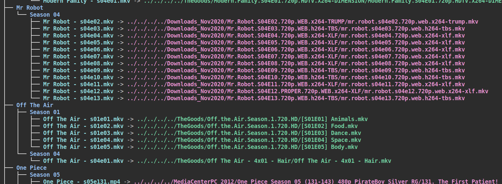

# media_index_tools
Scripts used to build a PLEX-compatible media index out of symlinks

Plex likes to have things... a certain way. Look, I'm just not that
organized, okay! I have a decade or so of content that I've finally cobbled
together from hard drives and machines that have long since been
relegated to nooks and corners. May be you do too? Well now that it's
all in one place, I might as well watch some of it. People told me:
"Use PLEX Jon!", so sure, if its good software, I should be able to
point it at my "data swamp" and let magic take care of the rest.
Nope. No PLEX has a specific structure it would very much like you to
use, and sure you can try the easy way, but its just not that good.

But here's the thing. I'm not doing this manually, and honestly,
I don't want to be mv'ing things all over the place, what if I
screw up? What if I wan't to change the way its organized?

So the idea is to have a tree structure parallel to the data swamp,
organized just how PLEX likes it, and the leaves of this tree?
Symlinks. That's it. Anyway, I like this idea, and it worked out
good for me and I think it will work going forward too.

There are a few steps:
1. Use media_tagger.py to build a tagging CSV
2. Go through the CSV manually and tag what parts of the
file name of each file contribute to the name and season
and episode. Sorry, there's no easy way here without some
fancy AI and maybe you can pull request me that good sh\*t,
but at least here, the tagger script makes some "educated
guesses" about simple tags.
3. Run media_linker.py to build the linking script. This is
just a shell script that makes the directory structure and
all the links by just calling mkdir and ln -s
4. Run the script made by the linker

This is VERY MUCH a do-at-your-own-risk kind of situation.
Like I'm only putting this on github because I accidentally
deleted the tagger script just now and github is kinda my
defacto code backup tool, so better late than never for the
linker script at least. Why the long readme then? Idk, just here
chillin with the cat and got a flow going. Maybe I'll read this
later on and remember what a farce this code was a just rewrite it.

Have a good day, also, let me know if there's a magic tool that
already does this. I liked my link tree idea and wanted to have a
go at implementing it so I didn't look around for something that
would actually solve the problem.

